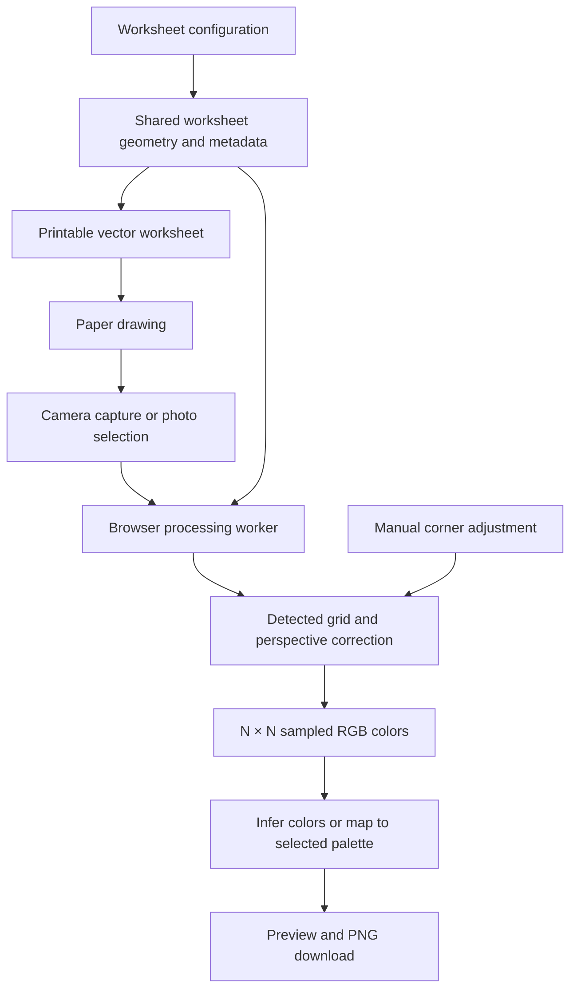

# High-Level Design: Paper Pixel

Status: Approved.

## Problem

People drawing pixel art on paper need a printable grid and a way to turn the finished drawing into an image with exactly one pixel per cell. Photographing paper introduces perspective distortion, grid lines, shadows, and color variation. Grid dimensions should control pixel resolution without reducing the physical drawing area.

## Approach

A Vercel-hosted frontend guides users through configure, print, draw, scan, and export. All worksheet generation, camera capture, marker detection, perspective correction, color sampling, palette reduction, and image export run in the browser. Photos and artwork stay on the device.

Generate a square worksheet with four distinct registration markers outside the drawing area. Recover its geometry from a camera photograph, sample the interior of each cell, and produce an N × N image. Offer manual corner adjustment when automatic detection is unsuccessful. Users either choose an inferred palette size or load an editable Lospec palette and map the original samples to its enabled colors. Users can change that size without photographing the worksheet again.

## Target Users

- People who prefer drawing with physical pens, pencils, or markers and want a digital pixel-art file.
- Parents and educators preparing large, printable grids for drawing activities.
- Pixel-art creators who need explicit dimensions and color limits.

## Goals

- Support integer square grids beginning at 2 × 2, with an upper bound established through device and print trials.
- Maximize the square drawing area within the selected paper's printable bounds while reserving space for registration markers.
- Support A4 and US Letter worksheets, with print preview and browser printing or saving as PDF.
- Capture a photograph with a phone camera or load an existing image.
- Correct rotation and perspective and preserve the worksheet's N × N logical pixel dimensions.
- Let users export PNGs at a configurable positive integer scale: 1× produces N × N pixels and s× produces (N × s) × (N × s) pixels with sharp edges.
- Support inferred palette sizes from two colors through Full RGB, and exact mapping to user-selected editable palettes.
- Provide a preview and recoverable controls for imperfect scans.
- Deploy as a static frontend on Vercel.

## Non-Goals

The initial release does not include accounts, cloud artwork storage, server image processing, Yoto account integration, rectangular grids, or a general-purpose drawing editor. Offline installation is not required for the initial release.

## Tenets

The following priorities apply in order:

1. Prefer processing on the user's device over centralized services.
2. Prefer generous drawing space over decorative worksheet content.
3. Prefer user-adjustable recovery over fully automatic conversion with hidden corrections.

## System Design

Use React and TypeScript with Vite to build a static application. Vercel serves the application and its processing assets. A browser worker performs expensive image-processing work to keep the interface responsive. Select and verify the browser-compatible marker detection implementation during detailed design; do not assume that a particular OpenCV JavaScript build includes ArUco support.

Component boundaries:

| Component | Responsibility |
|---|---|
| Worksheet | Configuration, physical page layout, markers, printable output, versioned geometry and metadata |
| Scanner | Camera lifecycle, image import, registration, perspective correction, cell sampling, scan recovery |
| Artwork | Inferred and selected palettes, Lospec imports and bundled presets, local editing/library, conversion, preview, PNG export |

The worksheet and scanner share one geometric definition so printed cell positions and sampled regions agree. Scanner output retains sampled RGB values separately from palette-converted output. Palette-size changes reuse completed results cached locally for the current sampled drawing or calculate from its original samples to avoid compounding quantization loss. The interface owns the current workflow state and session-memory cache; long-lived photo storage is not required.

## Key Design Decisions

### Browser processing with static hosting

All image processing occurs locally. A server processing alternative would offer a consistent runtime but require uploads, retention decisions, and processing infrastructure. Native applications would add installation and separate platform distribution. A browser frontend provides one URL for printing on a computer and scanning on a phone.

Vite provides a static build suitable for Vercel. React manages the configuration and scan review interface; TypeScript makes worksheet geometry and image-processing contracts explicit. Server rendering is unnecessary for the core workflow.

### Fixed drawing area, variable cell size

The largest usable square is determined by paper size, margins, and registration space. Its side length stays constant as N changes; each cell's side is the drawing area's side divided by N. A square cannot fill an entire rectangular page. Here, maximizing paper use means maximizing the usable square, without stretching cells or clipping markers. Exact margins and marker placement belong in detailed design.

### Registration and worksheet identity

Use four distinct ArUco-style registration markers to identify orientation and support perspective correction. A compact, separate QR code carries the format version and grid dimension so a sheet printed on one device can be scanned on another. Print the dimension in human-readable form and allow explicit entry if metadata cannot be decoded. Marker and grid geometry use a shared normalized layout that scales together on any paper; the scanner requires neither paper dimensions nor page edges. Paper selection controls printable page layout only. Metadata must be validated before allocating processing buffers. The worksheet design defines the version-1 encoding and marker dictionary.

### Color conversion

In From photo mode, users configure only the palette size. For a limit of K colors, calculate up to K representative colors from the sampled drawing and map each logical pixel to a representative color. Optimize the representation of the drawing under a color-error objective to be specified in detailed design. Palette colors may be calculated from groups of similar samples to consolidate variations in pigment coverage and capture; they need not be exact copies of individual photographed pixels.

A 1-bit palette permits two inferred colors. For a drawing whose cells are green and blue, calculate representative green and blue colors. Neither black nor white is reserved or assumed. From photo mode has no preset or manually chosen palette colors. The automatic palette is inferred from drawing-cell samples, excluding registration markers, grid lines, and page margins.

Full RGB retains the sampled 8-bit red, green, and blue channels without intentional palette reduction. A limited palette is a maximum distinct-color count, not a requirement to insert colors absent from the drawing. If the drawing contains fewer distinct colors than the selected capacity, retain those colors without manufacturing additional ones.

Sample cell interiors to avoid printed lines and aggregate samples to reduce paper texture. Full RGB represents the captured drawing; it does not promise exact recovery of pigment colors under arbitrary lighting. Uncolored cells participate as sampled paper colors. The artwork design defines the weighted Oklab objective, accepted capacities, and deterministic quantization algorithm.

### Selected palettes

Choose palette mode includes 24 statically bundled Lospec palettes, six per size 2, 4, 16, and 256, selected by descending download count at catalog creation. It also accepts a Lospec URL or slug. A Browse palettes on Lospec link opens in a new tab while preserving the drawing. The frontend downloads only public palette metadata directly from Lospec; photos and sampled pixels are never sent. Users can enable colors, edit a copy, add colors, undo, and reset to the imported palette. Selected palettes default to recoloring inferred source groups through editable group-to-color mappings. The drawing count is independent of palette capacity, and multiple groups may share a target. A direct closest-color method remains available for mapping original samples. Both selected methods use only exact enabled palette RGB values. The initial editable palette range is 2–256 distinct enabled colors.

Remember up to 16 imported palette definitions locally for reuse. Edited copies persist with their imported originals and attribution. Image results remain in a bounded session cache keyed by drawing revision and complete palette identity; no artwork is persisted. Failed imports or unavailable local storage do not discard current artwork. Keep From photo as the fresh-session default and preserve both modes' settings when switching.

### PNG export scaling

Keep the underlying artwork at N × N logical pixels. At export, users choose a positive integer scale starting at 1×, with the resulting width and height displayed before download. A 32 × 32 drawing exports as 32 × 32 at 1×, 64 × 64 at 2×, 128 × 128 at 4×, or 256 × 256 at 8×. These examples do not restrict the control to powers of two.

Enlarge using nearest-neighbor pixel replication: each logical pixel becomes a solid s × s block of the same color, without smoothing or new colors. Export scale does not change the printed worksheet, scan resolution, or chosen palette, and can be changed without rescanning. Default to 1×. The artwork design caps the output side at 4096 pixels and validates the requested scale before allocating the export image.

### Scan recovery and limits

Allow users to inspect grid alignment and adjust corners before conversion. Camera access requires browser permission and a secure context; photo selection provides an alternative input path. Report unreadable or undersampled scans clearly. Define a finite supported grid limit from measured image resolution, print legibility, memory, and performance. Larger grids must not silently produce invented detail.

## Success Metrics

- A 2 × 2 worksheet and every supported larger grid produce correctly oriented N × N PNGs at 1× and (N × s) × (N × s) PNGs at every supported integer scale s.
- Enlarged PNGs preserve each logical pixel as an exact s × s solid-color block, without interpolated colors; the displayed export dimensions match the downloaded file.
- Changing grid dimensions does not change the drawing area's physical extent for the same paper settings.
- Printed A4 and Letter trials retain the full grid and all registration markers within the page.
- Known-color fixtures confirm that grid lines are excluded and limited-palette output never exceeds the configured color count.
- A green-and-blue drawing produces representative green and blue at a two-color limit, without introducing black or white. Color-inference fixtures include variations within each color group.
- Changing palette size reuses a cached result for the current sampled drawing or computes from its original samples; repeated comparisons restore identical cached output without quantization work, and full RGB restores original samples without retained palette-reduction loss.
- Photographed worksheets validate automatic registration, tilted-sheet correction, and manual recovery on target phones. Record the tested lighting, dimensions, and devices before claiming a supported maximum.
- Network inspection confirms that photographs and sampled artwork are never uploaded by the application.
- A production static build supports the complete workflow on Vercel. The detailed designs identify target browsers and phones and provisional processing-time budgets; observed results and color tolerances require validation fixtures and physical trials.

## Detailed Designs and Validation Boundaries

- [Worksheet](intent/worksheet/worksheet-design.md): defaults to 32 × 32 and Letter; initial grid range 2 through 64; shared physical layout and versioned metadata.
- [Scanner](intent/scanner/scanner-design.md): registration, manual alignment, source-image bounds, recovery, and cell sampling with visible paper retained.
- [Artwork](intent/artwork/artwork-design.md): inferred palette capacities, deterministic color reduction, Full RGB default, and integer PNG export scaling starting at 1×.

The initial grid and image resource bounds require physical-device validation. Print readability, scan quality thresholds, processing-time targets, and memory use must be measured before claiming reliable behavior on representative phones.

## References

- [DoodlePix inspiration and creator's marker explanation](https://www.reddit.com/r/YotoPlayer/comments/1npam0k/my_daughter_wanted_to_draw_her_own_yoto_icons_so/)
- [OpenCV ArUco detection documentation](https://docs.opencv.org/4.13.0/d5/dae/tutorial_aruco_detection.html)
- [Vite on Vercel](https://vercel.com/docs/frameworks/frontend/vite)
- [Browser camera access requirements](https://developer.mozilla.org/en-US/docs/Web/API/MediaDevices/getUserMedia)
